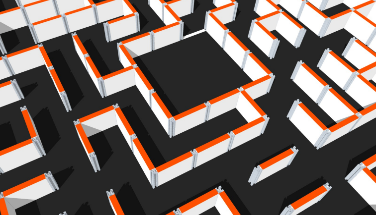
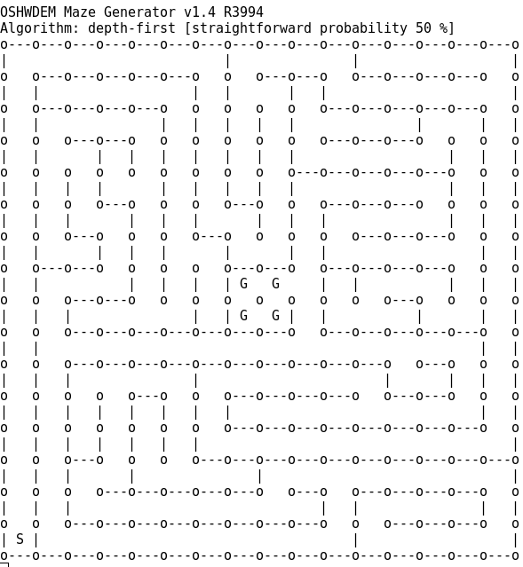

# OSHWDEM Mazes

[OpenSource Hardware Demonstration][OSH01] by [Bricolabs Group][BRI01] is the most important barcamp of makers in Galicia. Since 2014, there are robot challenges and [everybody is invited to participate][CON01].

One of the contest is the _Maze with robots_. This program is intended to be the maze generator according to the specific rules of the contest. It is compiled and executed on the big screen just in the beginning of the competition and the real maze is configured with the walls as shown on the big screen.

The source code is published so that you can study and generate mazes in order to audit the program and practice with maze configurations similar to the competition ones.

## Prepare the environment

You need a GNU/Linux distribution and Mono.NET runtime to execute the Maze Generator. 

Current version is fully tested with [Meikian Live][MEI01] and we encourage you to test this fantastic GNU/Linux distro focused on makers.

Get the precompiled binary file from Github:

    wget https://github.com/brico-labs/OshwdemMazes/raw/master/precompiled/MazeGenerator.exe

Maximize the terminal window to view all the maze on screen.

## Run the Maze Generator

The precompiled .NET binary is Mono.NET 4.0 compatible. Try to execute it with the command:

    mono MazeGenerator.exe

If something was wrong with the command, you probably need the Mono runtime. Debian flavours provide a Mono package and it is easy to install:

    sudo apt-get install mono-complete

See the official [_How to install Mono_][MON01] if you have another OS distro.

Note for Windoze users: it should work from a console. However, we do NOT offer support for privative operating systems.

## Compile the Maze Generator

Source code includes a _OshwdemMazes.sln_ file. Install MonoDevelop, open it and build the code. It generates a new binary under the _bin_ folder.

To install MonoDevelop:

    sudo apt-get install monodevelop

## License

Version 3 of the GNU General Public License (GPLv3). See LICENSE.txt.

## Extra commands

Command line forever!

### Massive maze generation

Generate 10 mazes and save them in a file:

    for T in $(seq 10) ; do echo "Thanks" | mono MazeGenerator.exe >> mazes.txt ; done

### Show and save at the same time

Save the maze in a file at the moment of generation:

    mono MazeGenerator.exe | tee -a mazes.txt

## Issues

Bug reports or suggestions [are welcome][ISS01].

[BRI01]: http://bricolabs.cc/
[CON01]: http://oshwdem.org/concursos/
[ISS01]: https://github.com/brico-labs/OshwdemMazes/issues
[MEI01]: http://meikian.eu/
[MON01]: http://www.mono-project.com/docs/getting-started/install/linux/
[OSH01]: http://oshwdem.org/

