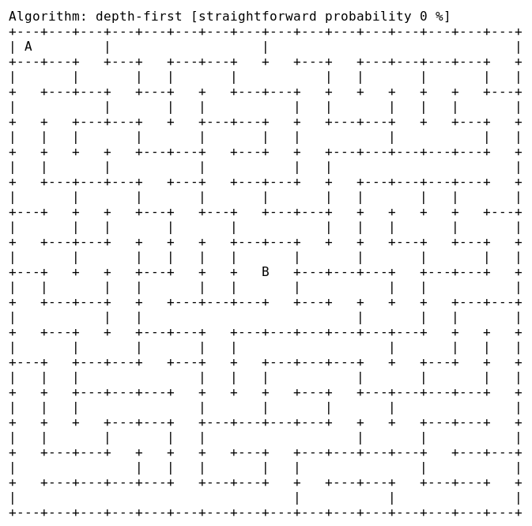

# OSHWDEM Mazes

-[Versión en español](README.es.md)-

[_OpenSource Hardware Demonstration_][OSH01] by [_Bricolabs Group_][BRI01] is the most important barcamp of makers in Galicia. Since 2014, there are robot challenges and [everybody is invited to participate][CON01].


One of the contest is the _Maze with robots_. This program is intended to be the maze generator according to the specific rules of the contest. It is compiled and executed on the big screen just in the beginning of the competition and the real maze is configured with the walls as shown on the big screen.


The source code is published so that you can study and generate mazes in order to audit the program and practice with maze configurations similar to the competition ones.


## Prepare the environment

You need a _GNU/Linux_ distribution and _Mono.NET_ runtime to execute the _Maze Generator_. Current version is fully tested with Debian.

Get the precompiled binary file from [_Github_ directory][PRE01]:

    wget https://github.com/brico-labs/OshwdemMazes/raw/master/precompiled/MazeGenerator.exe

Maximize the terminal window to view all the maze on screen.


## Run the Maze Generator

The precompiled binary is _Mono.NET 4.5_ compatible. Try to execute it with the command:

    mono MazeGenerator.exe

If something was wrong with the command, you probably need the _Mono runtime_. _Debian_ flavours provide a _Mono package_ and it is easy to install:

    sudo apt-get install mono-runtime

See the official [_How to install Mono_][MON01] if you have another OS distro.

Note for _Windoze and Osex users_: it should work from a console. However, we do NOT offer support for privative operating systems.


### Maze straightness

Since v1.3, there is a command line parameter to generate the maze with more straightened paths:

```
$ ./MazeGenerator.exe -h

OSHWDEM Maze Generator v1.3 R2276

-h --help
    Shows this help

-s --straightness
    Generates more straightness paths; float value (0.00 - 1.00), default is 0.00
```



This animation shows 6 mazes with 0.00, 0.20, 0.40. 0.60, 0.80 and 1.00 values used in the "-s" parameter.


## Compile the Maze Generator

Source code includes a _OshwdemMazes.sln_ file. Install _MonoDevelop_, open it and build the project. It generates a new binary under the _bin_ folder.

To install _MonoDevelop_:

    sudo apt-get install monodevelop


## License

Version 3 of the _GNU General Public License (GPLv3)_. See [_LICENSE.txt_](LICENSE.txt).


## Extra commands

Command line forever!


### Massive maze generation

Generate 10 mazes and save them in a file:

    for T in $(seq 10) ; do echo "Thanks" | mono MazeGenerator.exe >> mazes.txt ; done


### Show and save at the same time

Save the maze in a file at the moment of generation:

    mono MazeGenerator.exe | tee -a mazes.txt


## Issues

Bug reports or suggestions [are welcome][ISS01].


[BRI01]: http://bricolabs.cc/
[CON01]: http://rules.oshwdem.org/
[ISS01]: https://github.com/rafacouto/OshwdemMazes/issues
[MON01]: https://www.mono-project.com/download/stable/
[OSH01]: http://oshwdem.org/
[PRE01]: https://github.com/rafacouto/OshwdemMazes/tree/master/precompiled


